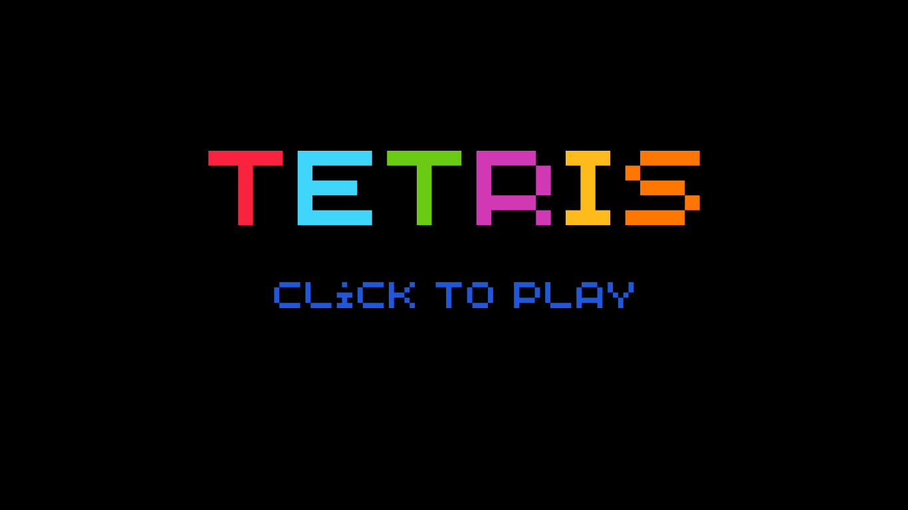
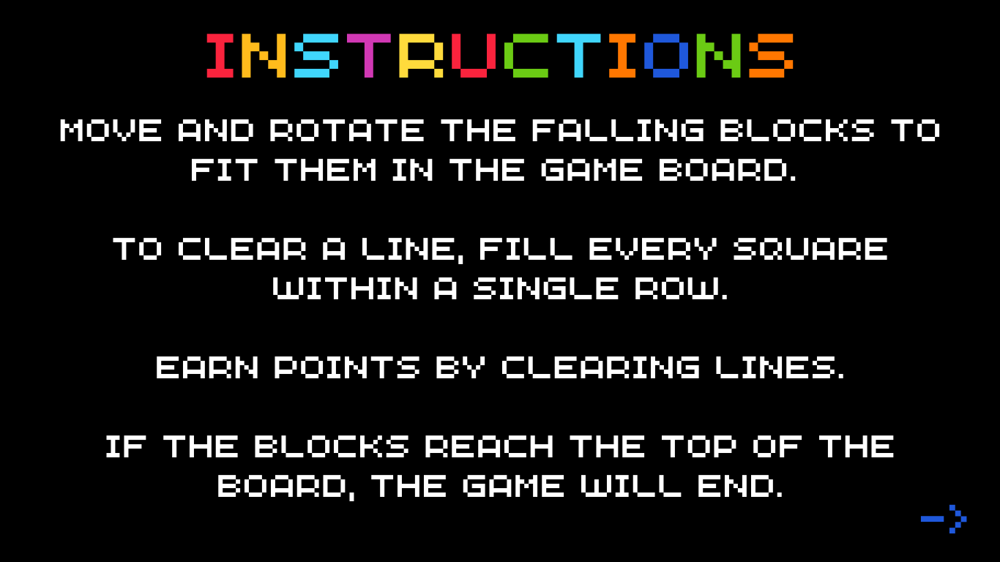
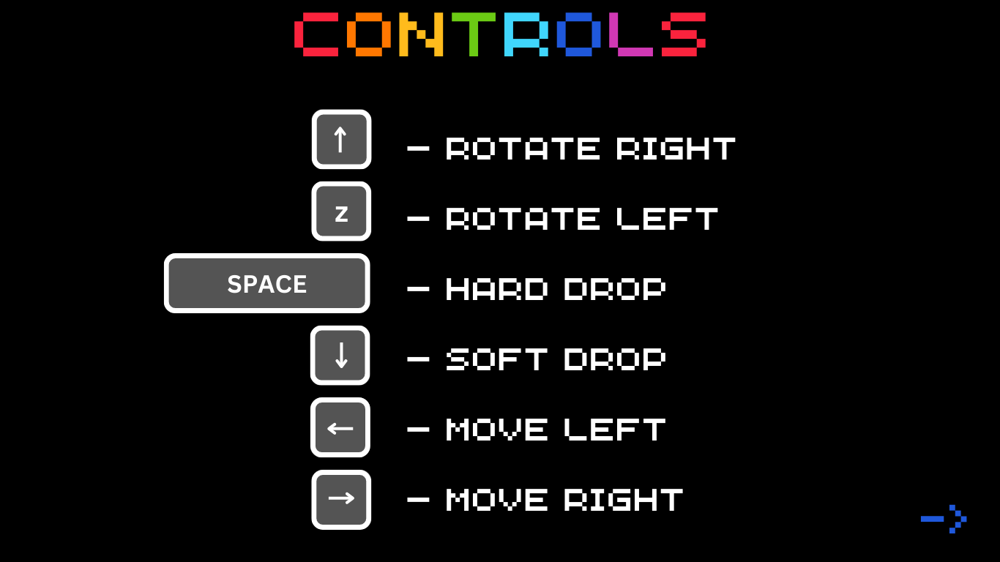
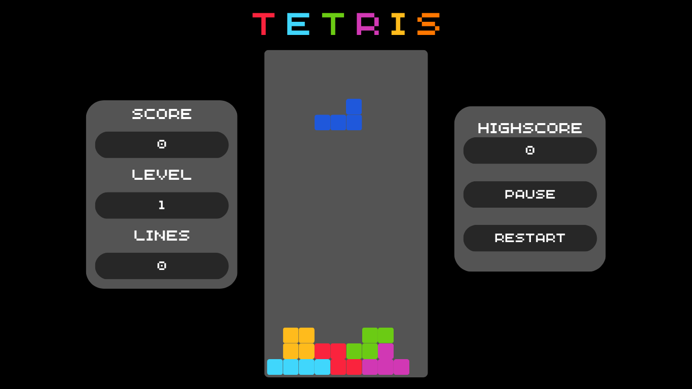
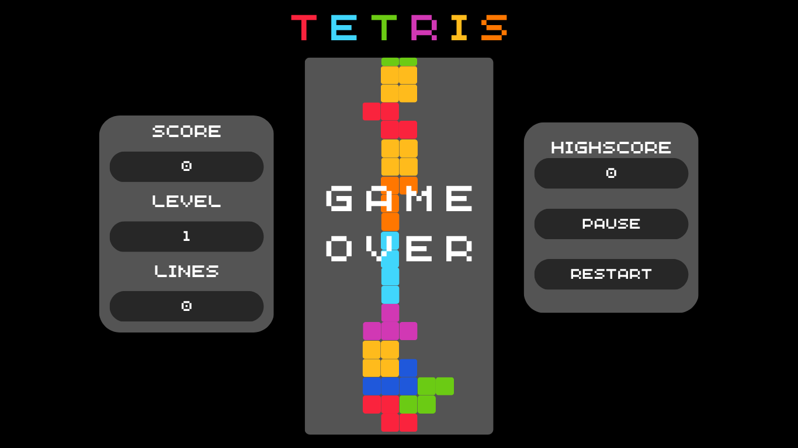
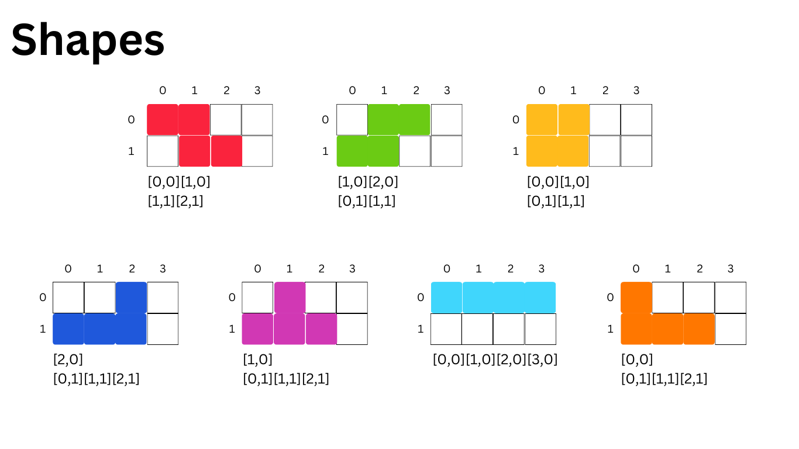

# Tetris

## Overview

A recreation of Tetris, a game where players are tasked with strategically placing blocks in order to clear lines and gain points before reaching the top of the board. 

### Link

TBC

### Technologies
- HTML (Canvas)
- CSS
- JavaScript

## User Stories

### MVP

```
As a user, I want the ability to:
- Click the screen to initiate game
- View instructions on how to play
- View a block falling down the screen
- Use my keyboard keys to rotate, move, and drop blocks
- Clear lines by filling entire rows with blocks
- View my score
- View my level
- View how many lines I have cleared
- View my highscore
- Pause the game
- Restart the game without refreshing the page
- Know when I have lost
- Hear music in the background while playing
```

### Extras

```
As a user, I want the ability to:
- View upcoming blocks
- Hold a block and use held block
- Be timed or know how long it took me to complete a level
- View where my shapes land
```

## Wireframes








## Game Mechanics

This game will utilize HTML canvas to create the game board and pieces and event listeners to register keystrokes. 
Context: 2d

### Variables
- boardHeight; boardWidth
- startX; startY
- score
- level
- highscore
- isPaused
### Arrays
- board coordinates
- current block
- block colors
- block shapes
### Objects
- keys
- coordinates
### Functions
- createBoard
### Event Listeners
- reset: click
- document: DOMContentLoaded, keydown
